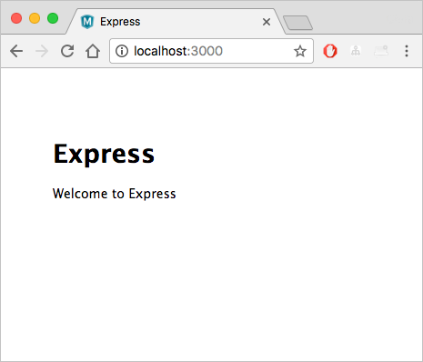

# Proyecto en NodeJS para Prácticas

## Requisitos

Se debe tener instalados:

- [NodeJS LTS](https://nodejs.org/es/)
- [VSCode](https://code.visualstudio.com/)

## Instalación

Para instalar todas las dependencias de la aplicación, vaya a la nueva carpeta y ejecute:

```javascript
npm install
```

## Ejecutar la Aplicación

A continuación, asegúrese de que se ejecute la aplicación. Desde la terminal, inicie la aplicación usando el comando:

```javascript
npm start
```

Ahora, abra su navegador y navegue hasta [http://localhost:3000](http://localhost:3000) donde debería ver algo como esto:



## Crear Web App para Node.js en Azure

1. Ingresamos al Azure Portal
2. En la barra de búsqueda escribimos: *App Services*
3. Damos clic en *Nuevo*
4. En la página Web App (Aplicación web), rellene estos campos:

| Campo                       | Valor                                                                                                                                                                                                                                                                        |
|-----------------------------|------------------------------------------------------------------------------------------------------------------------------------------------------------------------------------------------------------------------------------------------------------------------------|
| Suscripción                 | Su suscripción de Azure.                                                                                                                                                                                                                                                     |
| Grupo de recursos           | Seleccione Create new (Crear) y, a continuación, escriba nodejs-express-demo como nombre del grupo de recursos.                                                                                                                                                              |
| Nombre                      | Proporcione un nombre único, como nodejs-express-demo-1234. La instancia de App Service requiere un nombre único, ya que el nombre se convierte en parte del nombre de dominio. En la práctica, elija un nombre que describa el servicio. Anote el nombre para más adelante. |
| Publicar                    | Código                                                                                                                                                                                                                                                                       |
| Pila en tiempo de ejecución | Node 12 LTS                                                                                                                                                                                                                                                                  |
| Sistema operativo           | Linux                                                                                                                                                                                                                                                                        |
| Región                      | Seleccione cualquier región; preferiblemente, una cercana.                                                                                                                                                                                                                   |
| Plan de Linux               | mantenga el valor predeterminado.                                                                                                                                                                                                                                            |
| SKU y tamaño                | Seleccione Change size (Cambiar tamaño) > pestaña Dev/Test (Desarrollo/pruebas) > F1 > Apply (Aplicar).                                                                                                                                                                      |

## CI / CD Azure DevOps

1. Importar este repositorio en Azure Repos.
2. Crear Pipeline a partir de este repositorio.
3. Crear un stage para Build
   1. Instalar Node.js
   2. Instalar, compilar y test con npm
   3. Comprimir proyecto en zip
   4. Publicar artefacto
4. Crear stage para Deploy:
   1. Debemos mapear el environment
   2. Strategy: runOnce
   3. Tarea para despliegue en Azure Web App

Nota: Tener en cuenta que la configuración de este proyecto es *Node.js Express Web App to Linux on Azure*
